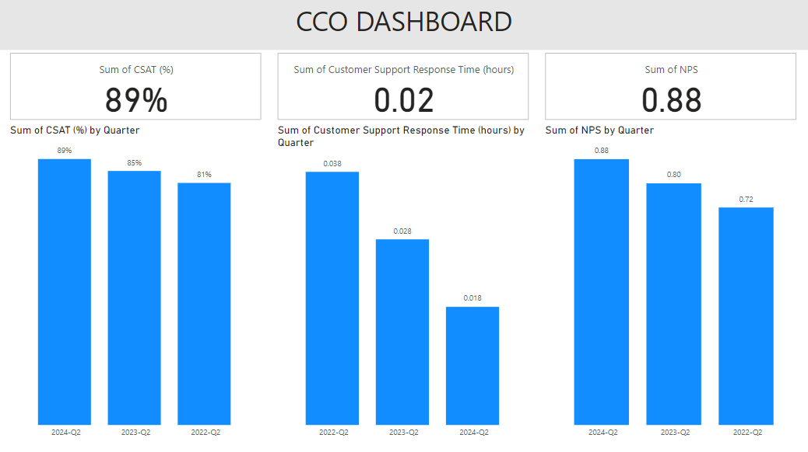

## CCO PBI Dashboard

## Overview
This repository contains a Power BI dashboard designed for the Chief Customer Experience Officer (CCO) role. The dashboard provides insights into key performance indicators (KPIs), customer satisfaction metrics, and strategic decision-making data. It aims to empower customer experience leaders with actionable insights to enhance customer engagement and drive business growth.

## Features
- **Interactive Visualizations:** Dynamic charts and graphs to visualize customer trends and satisfaction metrics.
- **Data Integration:** Seamless integration with various data sources, enabling real-time data updates.
- **Customizable Dashboards:** Ability to tailor the dashboard to specific business needs and metrics related to customer experience.
- **User-Friendly Interface:** Intuitive design for easy navigation and analysis.

## Getting Started
To get started with the Chief Customer Experience Officer Power BI Dashboard, follow these steps:

### Clone the Repository

### Open the Project:
1. Launch Power BI Desktop.
2. Open the .pbix file from the cloned repository.

### Connect to Data Sources:
Update the data source connections in the Power BI report as needed to reflect your organization's customer data.

## Usage
After setting up the dashboard, you can:
- Analyze customer trends and satisfaction metrics.
- Customize reports and dashboards based on your specific requirements.
- Share insights with stakeholders through Power BI Service or export reports.

## Contact
For questions, feedback, or collaboration inquiries, please reach out to me at:

**Email:** goelsanchit29@gmail.com

## Acknowledgments
Thank you to the contributors and resources that have made this project possible.
