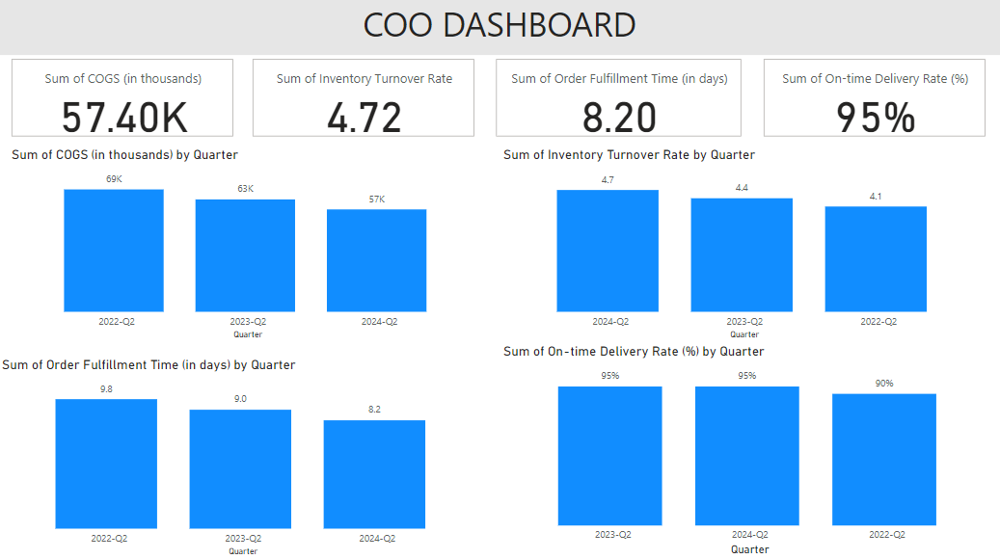

## COO PBI Dashboard

## Overview
This repository contains a Power BI dashboard designed for the Chief Operations Officer (COO) role. The dashboard provides insights into key performance indicators (KPIs), operational processes, and strategic decision-making metrics. It aims to empower operations leaders with actionable insights to drive business efficiency and growth.

## Features
- **Interactive Visualizations:** Dynamic charts and graphs to visualize operational trends and performance metrics.
- **Data Integration:** Seamless integration with various data sources, enabling real-time data updates.
- **Customizable Dashboards:** Ability to tailor the dashboard to specific operational needs and metrics.
- **User-Friendly Interface:** Intuitive design for easy navigation and analysis.

## Getting Started
To get started with the Chief Operations Officer Power BI Dashboard, follow these steps:

### Clone the Repository
- Clone the repository to your local machine.

### Open the Project:
- Launch Power BI Desktop.
- Open the .pbix file from the cloned repository.

### Connect to Data Sources:
- Update the data source connections in the Power BI report as needed to reflect your organization's data.

## Usage
After setting up the dashboard, you can:
- Analyze operational trends and performance metrics.
- Customize reports and dashboards based on your specific requirements.
- Share insights with stakeholders through Power BI Service or export reports.

## Contact
For questions, feedback, or collaboration inquiries, please reach out to me at:
- **Email:** goelsanchit29@gmail.com

## Acknowledgments
Thank you to the contributors and resources that have made this project possible.
