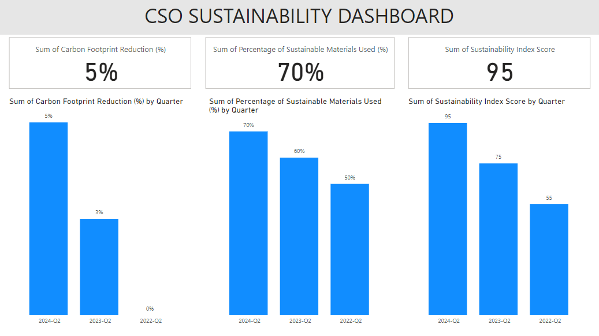

## CSO SUSTAINABILITY PBI Dashboard

## Overview
This repository contains a Power BI dashboard designed for the Chief Sustainability Officer (CSO) role. The dashboard provides insights into key sustainability metrics, environmental impact assessments, and resource management processes. It aims to empower sustainability leaders with actionable insights to drive environmentally responsible business growth.

## Features
- **Interactive Visualizations**: Dynamic charts and graphs to visualize sustainability trends and performance metrics.
- **Data Integration**: Seamless integration with various data sources, enabling real-time data updates.
- **Customizable Dashboards**: Ability to tailor the dashboard to specific sustainability goals and metrics.
- **User-Friendly Interface**: Intuitive design for easy navigation and analysis.

## Getting Started
To get started with the Chief Sustainability Officer Power BI Dashboard, follow these steps:

### Clone the Repository

### Open the Project:
1. Launch Power BI Desktop.
2. Open the .pbix file from the cloned repository.

### Connect to Data Sources:
Update the data source connections in the Power BI report as needed to reflect your organization's data.

## Usage
After setting up the dashboard, you can:
- Analyze sustainability trends and performance metrics.
- Customize reports and dashboards based on your specific requirements.
- Share insights with stakeholders through Power BI Service or export reports.

## Contact
For questions, feedback, or collaboration inquiries, please reach out to me at:

Email: goelsanchit29@gmail.com

## Acknowledgments
Thank you to the contributors and resources that have made this project possible.
