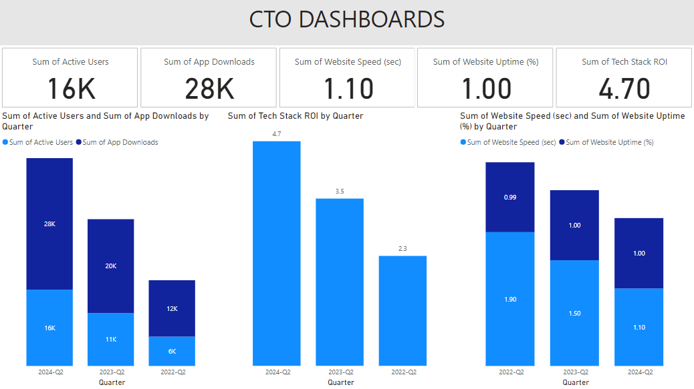

## CTO PBI Dashboard

## Overview
This repository contains a Power BI dashboard designed for the Chief Technology Officer (CTO) role. The dashboard provides insights into key performance indicators (KPIs), technology management processes, and strategic decision-making metrics. It aims to empower technology leaders with actionable insights to drive business growth.

## Features
- **Interactive Visualizations:** Dynamic charts and graphs to visualize data trends and performance metrics.
- **Data Integration:** Seamless integration with various data sources, enabling real-time data updates.
- **Customizable Dashboards:** Ability to tailor the dashboard to specific business needs and metrics.
- **User-Friendly Interface:** Intuitive design for easy navigation and analysis.

## Getting Started
To get started with the Chief Technology Officer Power BI Dashboard, follow these steps:

1. **Clone the Repository**

2. **Open the Project:**
   - Launch Power BI Desktop.
   - Open the .pbix file from the cloned repository.

3. **Connect to Data Sources:**
   - Update the data source connections in the Power BI report as needed to reflect your organization's data.

## Usage
After setting up the dashboard, you can:

- Analyze data trends and performance metrics.
- Customize reports and dashboards based on your specific requirements.
- Share insights with stakeholders through Power BI Service or export reports.

## Contact
For questions, feedback, or collaboration inquiries, please reach out to me at:

Email: goelsanchit29@gmail.com

## Acknowledgments
Thank you to the contributors and resources that have made this project possible.
